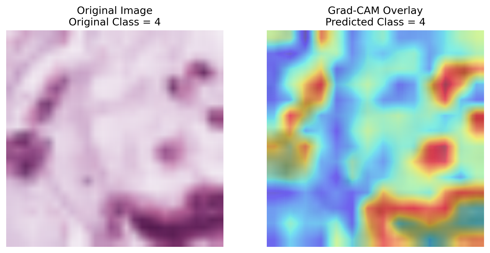
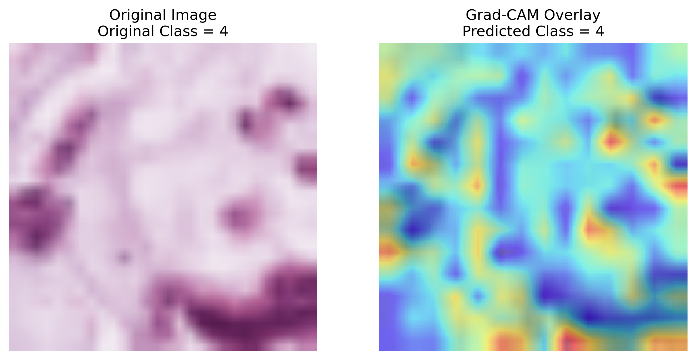
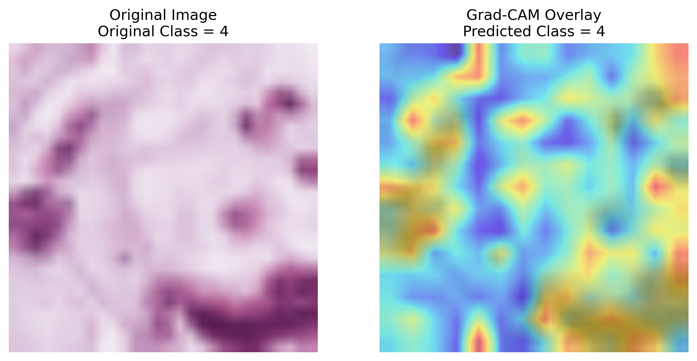

# SeeWhatYouShrink

## Installation
install the required packages. You can do this using pip:

```bash
pip install -r requirements.txt
```
## Training from scratch
We train a VIT Base Model (Patch size 16, image size 224) and a VIT Tiny Model (Patch size 16, image size 224) on the MedMNIST dataset. To run the training, you can use the following command:

```bash
python src/train.py --batch_size 64 --model vit_base_patch16_224 --epochs 30 --save_path vit_base_best.pth --lr 1e-5
```

To resume training from a checkpoint, you can use the following command:

```bash
python src/train.py --batch_size 64 --model vit_base_patch16_224 --epochs 30 --save_path vit_base_best.pth --lr 1e-5 --resume
```

## Trained models
To download pretrained checkpoints, use the following command:

```bash
bash checkpoints/get_checkpoints.sh
```

Refer to [this folder](./checkpoints) for more details.

To evaluate the trained models, use the following command:

```bash
python src/test.py --model <model_name> --ckpt_path <checkpoint_path>
```

The results from training are as follows:
| Model                  | Patch Size | Image Size | Test Accuracy (%) | Max Validation Accuracy (%) |
|------------------------|------------|------------|--------------|-----------------|
| ViT Base               | 16         | 224        | 83.16 | 98.03     |
| ViT Tiny               | 16         | 224        | 83.37 | 97.42     |

## GradCAM
To run explainability experiment using GradCAM, run the following command:

```bash
python3 src/explainability.py --model <model_name> --ckpt_path <checkpoint_path> --save_path <save_path>
```

### What does a GradCAM do?
GradCAM highlights the image regions that most influenced the model’s prediction. It works by computing the gradients of the target class with respect to the patch embeddings from a transformer block (usually the last one), excluding the [CLS] token. These gradients are globally averaged to obtain weights, which are then used to compute a weighted sum over the activations. This produces a 14×14 attention map, which is upscaled to 224×224 to match the input image size. The resulting heatmap visually indicates where the model "focused" when making its decision—the higher the gradient magnitude, the greater the region's importance.

### Visualisations
Base model:


Tiny Model


While both models are capable of accurately predicting the correct class, the base model demonstrates greater explainability compared to the tiny model. Specifically, the base model provides more insightful visualizations of the regions it focuses on during prediction, making it easier to interpret and understand the decision-making process of the model.

## Knowledge Distillation
Knowledge distillation is a technique where a smaller, simpler model (the "student") is trained to replicate the behavior of a larger, more complex model (the "teacher"). The student model learns not only from the ground truth labels but also from the soft predictions of the teacher, enabling it to achieve competitive performance with reduced computational requirements. This approach is commonly used to compress models for deployment on resource-constrained devices. Since the student learns using the teacher's predictions, it's able to learn the expressibility of the teacher model while being more efficient in terms of size and inference time.

To run knowledge distillation, use the following command:

```bash
python src/kd.py --teacher_model <teacher_model_name> --student_model <student_model_name> --ckpt_path <checkpoint_path> --save_path <save_path> --epochs 30 --batch_size 64 --lr 1e-5
```

Our checkpoints for knowledge distillation are available in the [checkpoints folder](./checkpoints).

The results from KD are as follows:
| Model                  | Patch Size | Image Size | Test Accuracy (%) | Max Validation Accuracy (%) |
|------------------------|------------|------------|--------------|-----------------|
| ViT KD Tiny               | 16         | 224        | 83.20 | 98.34     |

### GradCAM for Knowledge Distillation
We run the same explainability experiment using GradCAM for the knowledge distillation setup. The resultant heatmaps show that the student model is able to learn the expressibility of the teacher model, while being more efficient in terms of size and inference time. The explainability of the student model is comparable to that of the teacher model, demonstrating that it can effectively mimic the decision-making process of the larger model.




| Model | Inference Time per Sample (s) | Number of Parameters |
|-------|---------------------------|----------------------|
| ViT Base |    13.57      |    257.5M     |
| ViT Tiny |     2.92     |    16.6M     |
| ViT KD Tiny |   2.92       |    16.6M     |